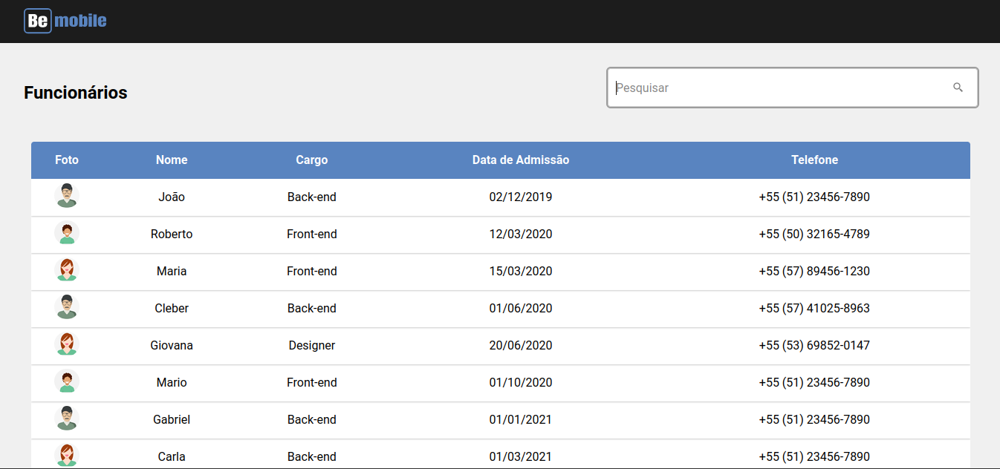
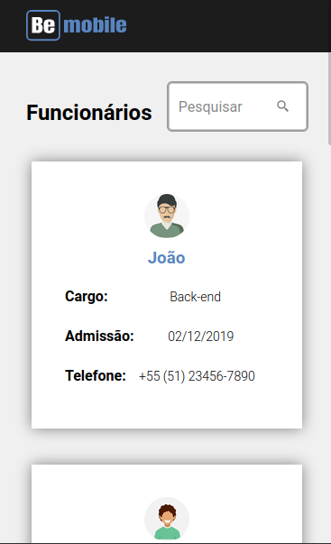
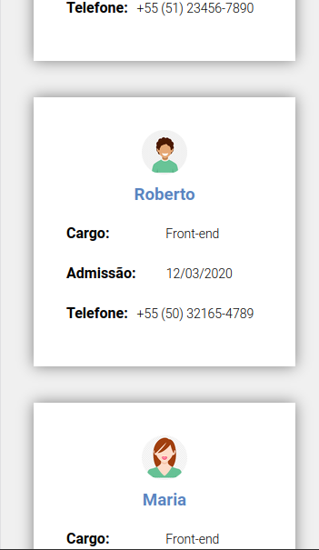

<h2 align="center">Gerenciador de Funcionários</h2>

<p align="center">App de gestão de funcionários desenvolvido com React para o teste técnico da empresa Bemobile</p>
<div align="center">
  
</div>
<div align="center">
  <a href="https://www.linkedin.com/in/rafaelalvesdemedeirosteixeira/">
    
  </a>
  <a href="https://github.com/teixeira83/">
    
  </a>
  <a href="https://pt-br.reactjs.org/">
    
  </a>
  <a href="https://github.com/typicode/json-server">
    
  </a>
</div>

<div style="margin-top: 30px">
<h4 align="let">Web App</h4>
  
</div>

<div style="margin-top: 30px">
  <h4 align="let">Mobile App</h4>
  <div>
    
    
  </div>
</div>

<div style="margin-top: 30px">
  <h3 align="left">Detalhes do Projeto</h3>
  <p>O app tem como objetivo listar os funcionários da empresa detalhando suas informações (Nome, Cargo, Data de Admissão, etc. ). As técnologias utilizadas foram :</p>

  <ul>
    <li><a href="https://pt-br.reactjs.org/">React</a></li>
    <li><a href="https://styled-components.com/">Styled-Components</a></li>
    <li><a href="https://github.com/typicode/json-server">Json-Server</a></li>
    <li><a href="https://github.com/axios/axios">Axios</a></li>
  </ul>
</div>

<div style="margin-top: 30px">
  <h3 align="left">Preparando o Ambiente</h3>
  <p>Para rodar o projeto será necessário ter instalado :</p>

  <ul>
    <li><a href="https://nodejs.org/en/">NodeJS</a></li>
    <li><a href="https://www.npmjs.com/">npm</a></li>
  </ul>
  
  <p>Clicando <a href="https://docs.npmjs.com/downloading-and-installing-node-js-and-npm">aqui</a> terá acesso à uma documentação de instalação.</p>
</div>
<br>
<h3 align="left">Rodando o Projeto</p>

<p>Faça o clone do repositório para a sua máquina com o comando abaixo ou faça o download do arquivo compactado e extraia onde preferir</p>

```
git clone https://github.com/teixeira83/GerenciadorDeFuncionarios
```

<p>Entre na pasta na pasta do projeto</p>

```
cd GerenciadorDeFuncionarios
```

<p>Instale as dependências do projeto</p>

```
npm i
```

<p><bold>Obs:</bold> Como o projeto está consumindo as informações de um servidor json local é necessário subir os dois servidores ( o React e o JsonServer ). Por padrão, quando são iniciados, eles sobem na porta 3000 então é necessário apontar uma porta diferente para um dos serviços. Neste caso subiremos o JsonServer na porta 3009 rodando o seguinte comando na pasta raiz do projeto :</p>

```
npx json-server --watch database/server.json --port 3009
```

<p>Para subir o servidor do React e poder utilizar o projeto basta rodar o seguinte comando na pasta raiz do projeto :</p>

```
npm start
```
<br>
<h3 align="left">Testando o Projeto</h3>

<p>Foram criados testes utilizando o framework jest e para rodar os testes é necessário rodar o seguinte comando na pasta raiz do projeto :</p>


```
npm run test
```

<p>Alguns links para mais informações sobre testes: </p>

<ul>
    <li><a href="https://jestjs.io/pt-BR/">Jest</a></li>
    <li><a href="https://testing-library.com/">Testin Library</a></li>
    <li><a href="https://kentcdodds.com/blog/common-mistakes-with-react-testing-library">Testin Library</a></li>
</ul>

<p>Não esqueça de mostrar o seu apoio deixando aquela ⭐️ !</p>
